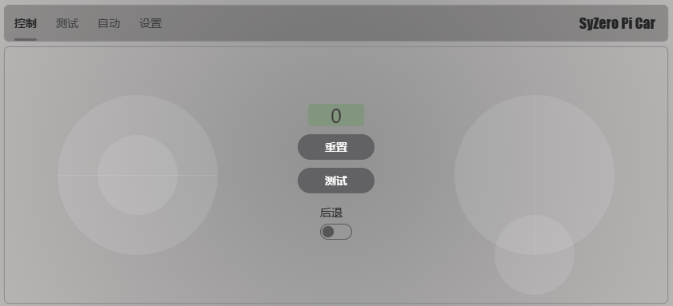
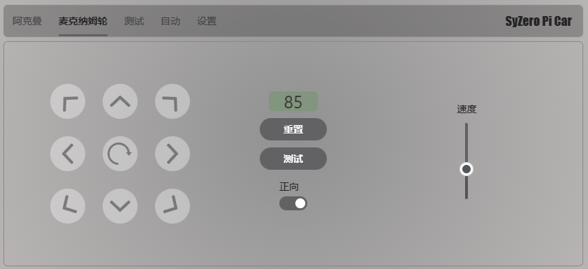

# SyZero Pi Car

#### 介绍
C#树莓派四轮小车


#### 进度
- [x] 阿克曼转向轮
- [x] 麦克纳姆轮
- [ ] AI寻路

#### 必备硬件

- 树莓派3b+/4b/cm4
- [RaspberryPi 多功能电机驱动扩展板](https://github.com/emakefun/RaspberryPi-MotorDriveBoard)

#### 软件架构
服务端使用.net6，通过websocket和客户端进行连接。

#### 安装&升级

```
bash <(curl -Ls https://raw.githubusercontent.com/winter2048/syzero-pi-car/master/install.sh) 
```

#### 使用说明




更多功能规划中...
