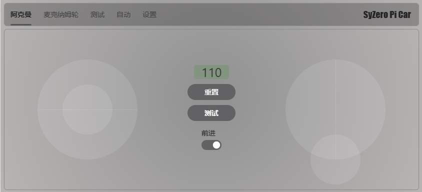

# SyZero Pi Car

#### 介绍
C#树莓派四轮小车

#### 进度
- [x] 阿克曼转向轮
- [x] 麦克纳姆轮
- [ ] AI寻路

#### 必备硬件

- 树莓派3b+/4b/cm4
- [RaspberryPi 多功能电机驱动扩展板](https://github.com/emakefun/RaspberryPi-MotorDriveBoard)

#### 软件架构
服务端使用.net6，通过websocket和客户端进行连接。

#### 安装教程

1.  xxxx
2.  xxxx
3.  xxxx

#### 使用说明

